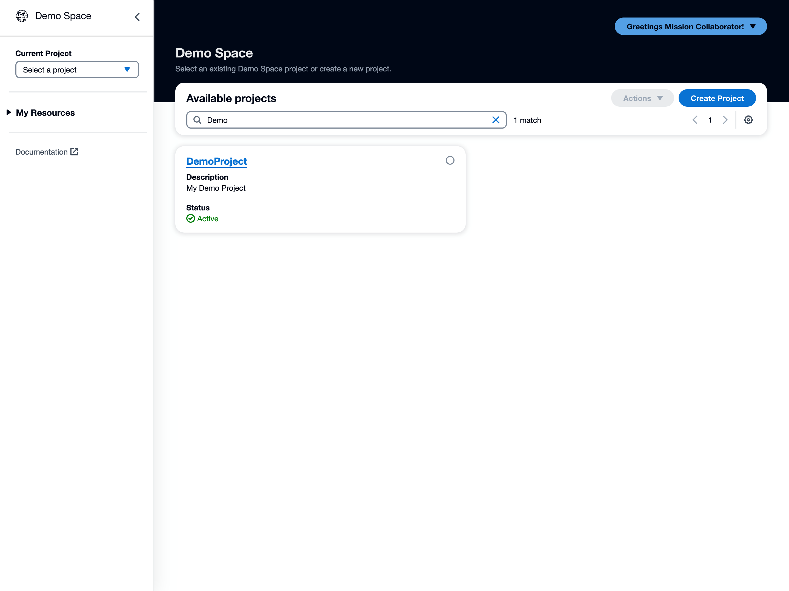
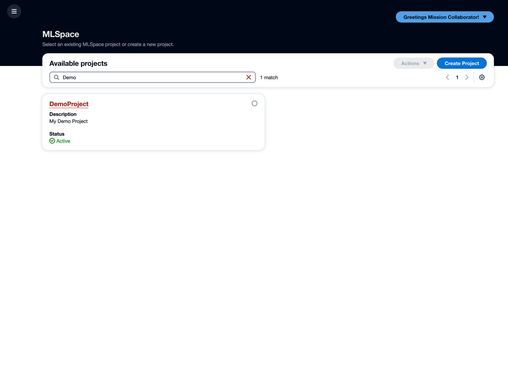

# Branding

Use the guide below to customize MLSpace to reflect your organization's unique branding.

## Display Name

Easily change the MLSpace name to align with your program or organization. This name is set in one place using the `APPLICATION_NAME` variable in the 'env.js' file. This value is generated during deployment and is updated in the `constants.ts` file in the CDK project files. By default, the value is "MLSpace."

When the `APPLICATION_NAME` is changed, the new name will appear to users everywhere MLSpace is used in the front-end of the application. The updated name will not be reflected in any backend resources, and no references to "MLSpace" in the source code will be changed.

In the example below, `APPLICATION_NAME` was set to "Demo Space."



## Logo Replacement

Keeping the default MLSpace logo has the following advantages:
- It dynamically changes color with theme changes.
- It satisfies accessibility criteria.
- The SVG is part of the bundle and will have to be replaced again after major updates.

It is possible to replace the logo by replacing the SVG in the `shared/layout/logo/logo.tsx` file in the front-end code.

If the logo is replaced with a new single-colored SVG, replacing the fill of the SVG drawing elements with 'currentColor' will allow it to adapt to the current theme by taking on the current font color of the side-navigation. This will only work if the new SVG logo is a single-colored SVG, as only the 'currentColor' changes with the mode swap.

The logo SVG can also be replaced with an image if desired.

### Light or Dark Mode Alternate Logos

To return different images or SVGs based on the current user mode preference, the following can be used when returning a logo in `shared/layout/logo/logo.tsx`:

```javascript
export default function Logo (props: LogoProps) {
    const currentUser = useAppSelector(selectCurrentUser);

    if (!currentUser.preferences?.displayMode || currentUser.preferences.displayMode === Mode.Light) {
        return (Light Logo Here);
    } else {
        return (Dark Logo Here);
    }
}
```

## Styles

Unique styles can be applied using the `public/theming.js` file, which uses [Cloudscape theming](https://cloudscape.design/foundation/visual-foundation/theming/) to apply custom themes targeted with [Cloudscape design tokens](https://cloudscape.design/foundation/visual-foundation/design-tokens).

For example, adding the following to `theming.js` will make all links in the application appear red:

```javascript
window.custom_theme = {
    theme: {
        tokens: {
            // Example that turns all links red
            colorTextLinkDefault: {
                light: '#9e2820',
                dark: '#db867d',
            }
        }
    }
};
```

