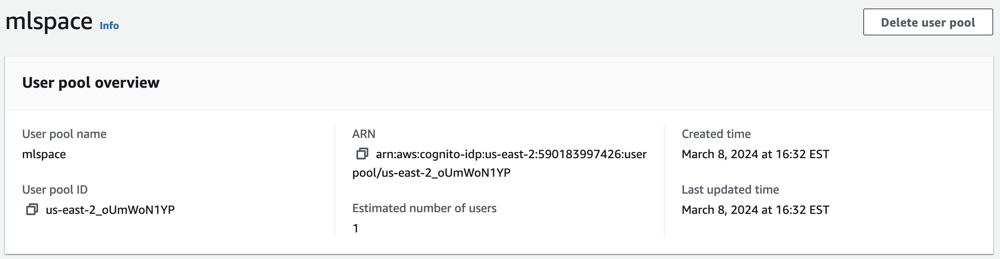
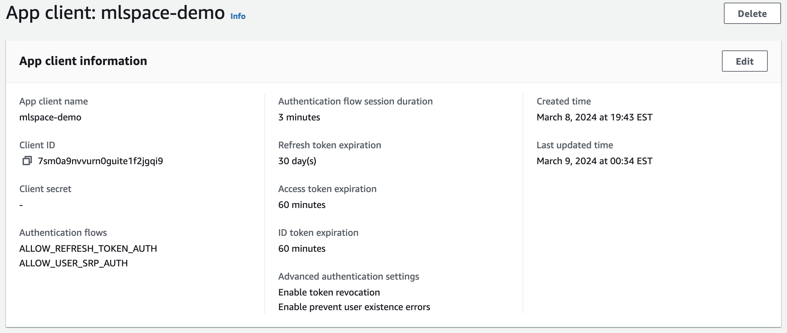

# Using AWS Cognito

{{ $params.APPLICATION_NAME }} requires an OIDC identity provider (IdP). If you don't have an existing IdP to integrate with, you can set up a new Cognito User Pool or, if you are already using Cognito, you can create a new application integration for your existing user pool.

## Creating a New Cognito User Pool

You can use the AWS console to create a new Cognito user pool. You can configure the pool however you want, but a minimal solution for internal testing and demo purposes can be achieved with the following configuration:

1. In the AWS console, navigate to the Cognito service.
2. Open the side menu and select "User pools."
3. Click "Create user pool."
4. Configure sign-in experience:
   1. Select the "User name" checkbox.
   2. When it pops up, select "Allow users to sign in with a preferred user name."
5. Configure security requirements:
   1. Use the default password policy (Cognito defaults).
   2. Enable "Optional MFA."
      1. Select the preferred MFA method option.
   3. Uncheck "Enable self-service account recovery - Recommended."
6. Configure sign-up experience:
   1. Uncheck "Enable self-registration."
   2. Uncheck Cognito assisted verification, "Allow Cognito to automatically send messages to verify and confirm - Recommended."
   3. For required attributes, select: "email," "name," and "preferred_username."
7. Configure message delivery:
   1. Select "Send email with Cognito."
      1. (We’re not allowing self-service, so we won’t be sending any emails besides the initial account creation notification.)
   2. Provide a name for the new IAM role for SMS messaging.
8. Integrate your app:
   1. Enter a user pool name, e.g., `mlspace-test.`
   2. Check "Use the Cognito Hosted UI."
   3. Enter a value for a "Cognito domain."
   4. Select "Public Client" for the initial app client.
   5. Enter a name of your choice for the App client name, e.g., `mlspace-web-app.`
   6. Do not generate a client secret.
   7. Enter a temporary callback URL.
      1. (The value does not matter and this will be changed once we deploy {{ $params.APPLICATION_NAME }}.)
   8. Advanced app client settings:
      1. Scroll down to "OpenID Connect scopes" and add the Profile scope.
9. Review and create:
   1. As desired, check for discrepancies in the review, then click "Create user pool."

At this point, you can follow the instructions in the "Connecting to an existing Cognito User Pool" section to connect your newly created User Pool to {{ $params.APPLICATION_NAME }}.

## Connecting to an Existing Cognito User Pool

In order to connect {{ $params.APPLICATION_NAME }} to an existing Cognito user pool, you will need the following information:

- **User pool ID**: This value is visible in the AWS console when viewing the user pool details page, as shown in the screenshot below:



- **Client ID**: If you already have an existing app client for your user pool that is configured for OIDC, you can view this value on the app client details page, as shown in the screenshot below:



Once you have these two values, you can update the `constants.ts` file in the `lib/` application source directory. The Cognito Client ID value will need to be used for `OIDC_CLIENT_NAME`, i.e.:

```javascript
export const OIDC_CLIENT_NAME = '7sm0a9nvvurn0guite1f2jgqi9';
```

The value for User Pool ID should be combined with the correct region endpoint from [AWS Cognito Identity Documentation](https://docs.aws.amazon.com/general/latest/gr/cognito_identity.html) to form the `OIDC_URL`. In the example above, the User Pool exists in the `us-east-2` region, so the full endpoint would be `https://cognito-idp.us-east-2.amazonaws.com/us-east-2_oUmWoN1YP`. In the `constants.ts` file, this endpoint should be assigned to the `OIDC_URL` variable:

```javascript
export const OIDC_URL = 'https://cognito-idp.us-east-2.amazonaws.com/us-east-2_oUmWoN1YP';
```

Once both values have been updated, you can build and deploy {{ $params.APPLICATION_NAME }}, and it will use Cognito as the IdP. Once {{ $params.APPLICATION_NAME }} is deployed, you will have to update your Cognito app client to add the {{ $params.APPLICATION_NAME }} API Gateway endpoint to the list of "Allowed callback URLs." You can do this by navigating to the App Client details page, scrolling down to the hosted UI, and clicking the edit button. From there, you will need to add your custom domain or the {{ $params.APPLICATION_NAME }} API Gateway endpoint to the URL list. If you aren't using a custom domain, that value should be something similar to `https://<api id>.execute-api.<region>.amazonaws.com/Prod`.

## Troubleshooting

- If you log in to Cognito but it doesn’t redirect you to {{ $params.APPLICATION_NAME }} but rather to a Cognito hosted error page, you can check if the URL includes a reason for the failure (typically `redirect_mismatch`).
- If you log in to Cognito and get redirected to {{ $params.APPLICATION_NAME }} but do not see your name in the top right on the `Greetings !` button, then you’re missing a required `name` parameter in your OIDC profile.
- You can use your browser's dev tools to check if the `POST /user` request is failing. Failing calls to `GET /currentUser` are expected until the user exists.