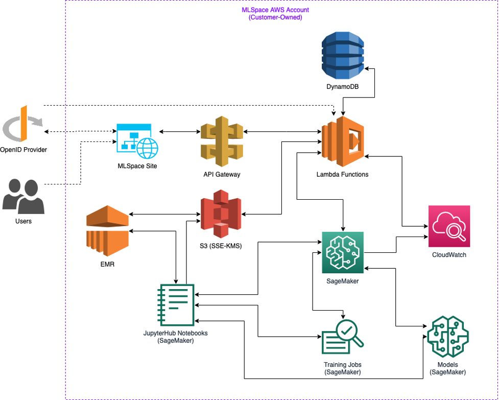

# High Level Overview

What is {{ $params.APPLICATION_NAME }}?

- {{ $params.APPLICATION_NAME }} is an auto-provision system that enables users with valid identity provider (IdP) credentials to securely interact with Amazon AI/ML APIs through a custom AWS console-like UI without needing direct access to the AWS console.
- {{ $params.APPLICATION_NAME }} creates secure data science environments and allows users to self organize and collaborate via projects
- {{ $params.APPLICATION_NAME }} allows the creation of Notebooks instances (traditionally backed by AWS Sagemaker) which are machine learning optimized compute instances to conduct analysis and experimentation. For big data and compute intensive workloads these instances can also be attached to AWS EMR clusters.

What makes {{ $params.APPLICATION_NAME }} different than AWS SageMaker?

- AuthN/AuthZ is delegated to the owning organizations OpenID Connect (OIDC) compatible IdP
- Dynamic policies are generated for each user and project enforcing data access restriction based on S3 naming convention within the datasets bucket
- When a user is assigned to a project a dynamic role is created that contains the user policy, the project policy, and a default policy to restrict both the data the user’s notebook and jobs can access as well as the actions they can take.
- {{ $params.APPLICATION_NAME }} also adds the concept of projects to allow easy collaboration across users with common datasets.
- Users can easily upload, manage, and share data sets for use in their AI/ML workloads.

How is access to SageMaker resources controlled?

- All {{ $params.APPLICATION_NAME }} resources are tagged with the associated project and user (as well as a “system” tag associating them with {{ $params.APPLICATION_NAME }} in general)
- These tags are used to determine which users have access to a given resource as well as which action they can take against a given resource
- **NOTE** Currently when creating resources within a jupyter notebook users will need to manually tag their resources to ensure they can view/edit them from within the {{ $params.APPLICATION_NAME }} UI. Examples of this are provided within the example notebooks.

## Repository Structure

The {{ $params.APPLICATION_NAME }} repository consists of 2 directories which correspond to specific pieces of the application: `backend` and `frontend`.

### Deployment

The top level directory contains the CDK code necessary for deploying {{ $params.APPLICATION_NAME }} within an AWS account. Components are broken out logically into stacks. Some stack are unnecessary depending on the particular deployment environment.

- **RestAPIStack** (`lib/stacks/api/restApi.ts`) This is the primary API Gateway (APIGW) stack. It includes a number of nested stacks for api resources grouped by functionality. In addition to the APIGW this stack is also responsible for deploying all of the backing lambdas and the lambda authorizer. This stack also deploys the static website resources including the dynamically generated website config file which contains the APIGW endpoint and IdP settings.
- **CoreStack** (`lib/stacks/infra/core.ts`) This stack creates the required DynamoDB (DDB) tables and S3 buckets. It also sets up the S3 Event Notification lambda which monitors the dataset bucket and creates new datasets when files are uploaded. The dynamically generate notebook-params file is also generated and deployed as part of this stack as well as all other “config” resources (all files in lib/resources/config/). Lastly sample notebooks and data is also deployed as part of this stack.
- **SagemakerStack** (`lib/stacks/infra/sagemaker.ts`) This stack creates the default lifecycle configuration used for {{ $params.APPLICATION_NAME }} notebooks. The onStart and onCreate scripts are based on the templates that exist in `lib/resources/sagemaker/`.
- **IAMStack** (`lib/stacks/iam.ts`) This stack will apply {{ $params.APPLICATION_NAME }} specific restrictions to the provided notebook role and depending on whether or not dynamic role management is enabled it will restrict S3 access as well. It also creates an S3 reader role to allow APIGW to access the static website assets bucket.
- **KMSStack** (`lib/stacks/kms.ts`) This stack creates a KMS key for encrypting {{ $params.APPLICATION_NAME }} S3 bucket contents and provides access to necessary key operations to the notebook role.
- **VPCStack** (`lib/stacks/vpc.ts`) This stack will create a basic VPC with a public and private subnet for use by {{ $params.APPLICATION_NAME }}. It is expected that {{ $params.APPLICATION_NAME }} will typically be deployed into an existing VPC but depending on the deployment this stack may be needed (or may just need additional customization)

Other notable files within the deployment directory:

- `lib/constants.ts` If you need to make environment specific customizations all changes should be made in this file (advanced configurations may require additional changes). This file contains default values for things like bucket names, config file names, ddb table names, OIDC configuration settings, system banner settings, default role arns, and VPC data. This file is prepopulated with default values that will work for standing up a complete end to end demo in a commercial AWS partition. Values from this file are used across stacks so that you’ll only need to make changes once. Depending on which values are set some stacks may or may not get deployed for example setting the VPC id, name, and default security group will skip the VPC stack. For additional details on each of the available parameters consult the README.md file
- `lib/resources/*` The resources directory contains various config files and templates that are used for the application and may need to be customized based on specific customer requirements. The files here are typically pushed to S3 by various stacks via BucketDeployment constructs.

### Backend

The backend directory contains all of the {{ $params.APPLICATION_NAME }} lambdas as well as the corresponding unit tests. In general the lambda handlers are grouped by functionality into a single parent lambda ie all CRUD operations for project are in `src/ml_space_lambda/project/lambda_functions.py`. Common functionality (decorators, config helpers, dynamic role management, etc) is included in the `utils/` directory. All interaction with the backing datastore (DDB in the current iteration) is handled by through the data access layer (`src/ml_space_lambda/data_access_objects/`). None of the lambdas read/write directly from the data store and instead leverage the data access layer for those interactions. This allows for easier unit testing as well as the ability to swap out the data layer should it be required.

All APIGW lambda handlers use the `“`@api_wrapper`”` decorator which handles logging the request parameters, generating the appropriate HTML response with required CORS headers, logging any errors with stacktraces, wrapping errors in an appropriate HTML response (400 unless it’s a boto exception with a HTTPStatusCode). The authorizer and s3 event notification lambda leverage similar wrappers to ensure we have uniform logging across the application. By default HTTP response have the following headers:

```json
{
    "Access-Control-Allow-Origin": "*",
    "Content-Type": "application/json",
    "Cache-Control": "no-store, no-cache",
    "Pragma": "no-cache",
    "Strict-Transport-Security": "max-age:47304000; includeSubDomains",
    "X-Content-Type-Options": "nosniff",
    "X-Frame-Options": "DENY",
}
```

Depending on the deployment environment these headers may need to be change and can be edited in `src/ml_space_lambda/utils/common_functions.py`.

When using dynamic role management, the default user and project policy templates are currently embedded in `src/ml_space_lambda/utils/iam_manager.p`y. These templates may need to be tweaked for specific deployment environments. There are a number of place holder variables that will be automatically replaced at runtime including `$PARTITION`, `$BUCKET_NAME`, `$PROJECT_NAME`, and `$USER_NAME`. {{ $params.APPLICATION_NAME }} will create 1 policy per project and 1 policy per user. When a user is added to a project a single role will be created that has both the user policy and project policy attached (as well as a base policy). The role will be removed when the project is suspended or deleted, the project policy will be removed when the project is deleted, and the user policy will be deleted if the user is deleted. Removing a single user from a project will not impact the project or user policies.

Unit tests for all lambdas can be found in the `test/` directory which each subdirectory corresponding to a folder in `src/ml_space_lambda`. Unlike the lambdas, tests are generally broken out into individual files for each individual lambda handler ie `test_create_project.py`, `test_delete_project.py`, `test_get_project.py`. Tests leverage mock, moto, and pytest depending on what exactly is being tested. The private/public key pair in `test/authorizer/` are solely for testing authorization token signature validation and are not intended to be used to secure anything in a production application. As of the current release {{ $params.APPLICATION_NAME }} has 97% code coverage for the lambdas, the tests can be executed and a coverage report can be generated by running the following command:

```bash
pytest -s -v --html=test-reports/report.html \
    --self-contained-html \
    --cov=ml_space_lambda \
    --cov-report=xml:coverage.xml \
    --junitxml=test-reports/junit.xml \
    --log-file=test-reports/logs.txt \
    test
```

The current deployment method is to deploy the entire codebase to each lambda as opposed to limiting what is deployed to just the code needed by that lambda. Switching to only deploy the necessary code (and moving common objects to a layer) would be a small change but given the existing small codebase and the ease in debugging afforded by including the entire code base the decision was made to not optimize for code size at this time.

### Frontend

The {{ $params.APPLICATION_NAME }} web application is a react redux based typescript application. Code is generally grouped by functionality in the `entities/` or `modules/` directories depending on whether or not the code is related to {{ $params.APPLICATION_NAME }} resources or is a generic component. The package.json file defines a number of scripts that can be used to execute tests, create a production optimized build, or run the app in development mode. When running in development mode you’ll need to set the values in publc/env.js based on the target environment (in production deployments this file is generated dynamically via CDK).

The frontend leverages a number of open source libraries to both speed up development as well as reinforce best practices. The UI is built around [CloudScape](https://cloudscape.design/), an open source component library developed by AWS that aims to assist in building accessible user interfaces that share a similar UX with the AWS console. In order to seamlessly integrate with spec compliant OIDC providers `react-oidc-context` is used. This library handles the PKCE authentication flow as well as periodic token refreshing. _Eslint_, and _Husky_ are used to enforce common coding standards, consistent styling, and best practices throughout the codebase.

## Architecture



### DynamoDB

There are 7 DynamoDB tables used to persist various types of metadata for {{ $params.APPLICATION_NAME }}.

#### Users Table

The users table contains user metadata pulled from the IdP as well as additional metadata used by {{ $params.APPLICATION_NAME }}. The partition key is `username`.

|Attribute|Type|Description|
|--|--|--|
| username | String| Pulled from IdP “preferred_username”. This is treated as a unique identifier for each user. |
| displayName | String| Pulled from IdP “name”. This is assumed to be a friendly display name which is used in the various places in the UI. |
| email | String| Pulled from IdP “email”. This could be the same as username, while it’s displayed in the UI there is no default capabilities which email users. |
| suspended | Boolean| Whether or not the user is currently suspended from the system. Suspended users are unable to launch resources or login to the system. |
| lastLogin | Number| Timestamp of the last time a user logged into the system. |
| permissions | List| Array of the system level permissions a user has in {{ $params.APPLICATION_NAME }}. Currently the only system level permission available to users is “ADMIN”. **NOTE** Permissions are not pulled from the IdP. |
| createdAt | Number| Timestamp of when the user account was created in {{ $params.APPLICATION_NAME }} (initial login when using default configuration) |

#### Projects Table

The projects table contains project level metadata such as project name, description, creation date, the creator of the project, and whether or not the project is currently suspended. The partition key is `name`.

|Attribute|Type|Description|
|--|--|--|
| name | String | Display name for the project. This is treated as a unique identifier for each project.|
| description | String | Text describing the project. This is displayed in the UI to help users identify a project and the potential use cases associated with that project.|
| createdBy | String | The username of the user who initially created the project.|
| suspended | Boolean | Whether or not the project is currently suspended from the system. Suspended projects retain resources but those resources will only exist in a stopped/suspended state.|
| lastUpdatedAt | Number | Timestamp of the last time the project was updated. Currently this is only changed when a user modifies the project description.|
| createdAt | Number | Timestamp of when the project was created in {{ $params.APPLICATION_NAME }}.|

#### Project Users Table

The projects users table serves as a mapping table between projects and users. Additionally it contains the permissions which a particular user has on the corresponding project and assuming dynamic roles are enabled the role ARN of the unique project user role. The partition key is `project` and the sort key is `user`. There is a Keys Only projection global secondary index (GSI) for reverse lookup with a partition key of `user` and a sort key of `project`.

|Attribute|Type|Description|
|--|--|--|
| project | String | Unique identifier of the project a particular record pertains to.|
| user | String | Unique identifier of the user a particular record pertains to. |
| permissions | List | Array of the project level permissions a user has for the associated project. Currently the only relevant project level permission is “MO” which is “ownership” level permissions. “CO” or collaborator is also supported as a legacy permission but does not currently have any significance.|
| role | String | ARN of the dynamic project user role for a particular record. If dynamic roles are disabled this attribute will be an empty string.|

#### Datasets Table

The datasets table contains metadata for datasets in {{ $params.APPLICATION_NAME }}. This data is populated from the S3 object tags on items in the “mlspace-data” bucket. The partition key is `scope` and the sort key is `name`. There is a Keys Only project GSI for reverse lookups with a partition key of `name` and a sort key of `scope``.

|Attribute|Type|Description|
|--|--|--|
| name | String | User specified name associated with a dataset.|
| scope | String | Scope will depend on type. If it’s a global dataset then scope will also be “global”. If the type of dataset is “project” then scope will be the project name. If the type of dataset is “private” then scope will be the username.|
| type | String | Can be “global” which means that all {{ $params.APPLICATION_NAME }} users can access the data, “project” which means that only members in the same project creating/using resources in that project can access the data, or “private” meaning that only the user who created the dataset can access the data |
| description | String | User provided description for the files contained within the dataset.|
| location | String | The S3 uri of the dataset.|
| createdBy | String | Unique identifier of the user who created the dataset|
| createdAt | Number | Timestamp of when the dataset was created in {{ $params.APPLICATION_NAME }} (based on timestamp of object detection of)|
| lastUpdatedAt | Number | Timestamp of when the dataset metadata was last updated in {{ $params.APPLICATION_NAME }} |

#### Resource Schedule Table

The resource schedule table contains metadata for terminating and pausing resources in {{ $params.APPLICATION_NAME }}. This
data is populated when a project is configured with resource termination and resources are created within
that project. The partition key is `resourceId` and the sort key is `resourceType`.

|Attribute|Type|Description|
|--|--|--|
| resourceId | String | The unique identifier for the resource, usually name. |
| resourceType | String | The type of resource to be acted upon. |
| project | String | The project the resource is associated with. |
| terminationTime | Number | Timestamp of when the resource should be paused or terminated. |

#### Resource Metadata Table

The resource schedule table contains metadata for terminating and pausing resources in {{ $params.APPLICATION_NAME }}. This
data is populated when a project is configured with resource termination and resources are created within
that project. The partition key is `resourceType` and the sort key is `resourceid`. There is are two local secondary indexs, one with a sort key of `project` and the other with a sort key of `user`.

|Attribute|Type|Description|
|--|--|--|
| resourceType | String | The type of resource to be acted upon. |
| resourceId | String | The unique identifier for the resource, usually name. |
| metadata | Map | Metadata associated with the resource such as current status, last updated timestamp, etc. |
| project | String | The project the resource is associated with. |
| user | String | The user who created the resource. |

#### Application Configuration Table

The app configuration table contains dynamic configuration settings for {{ $params.APPLICATION_NAME }}. The table is populated with default values the first time it is deployed, and then admins can modify the dynamic configurations for {{ $params.APPLICATION_NAME }} by navigating to the `Configuration` page accessible only to admins.

|Attribute|Type|Description|
|--|--|--|
| configScope | String | Determines the scope of the configuration. Currently the only scope supported is 'global', which means it has an effect over the entire application. |
| versionId | Number | The version ID of this configuration. Starts at 0 and increments with each update to the config. Configs are never overwritten or deleted so they are always around for rollbacks and auditing. |
| changedBy | String | The user who made an update to the config. |
| changeReason | String | The user-provided reason for changing the config. |
| configuration | Map | Configuration settings such as active/inactive services, system banner, allowed instance types, and more. |
| createdAt | Number | Epoch in seconds for when the config was created. |

### S3

{{ $params.APPLICATION_NAME }} creates and leverages 4 AWS S3 buckets. These buckets are used to store logs, system data, static website assets, and user generated data. By default each bucket name has the AWS account id prepended to ensure uniqueness within the partition.

| Bucket Name | Purpose | Access |
|--|--|--|
| mlspace-access-logs | If access logging is enabled this bucket will contain all S3 bucket access logs as well as API Gateway access logs | No external access by default |
| mlspace-logs | This bucket contains log exports generated by users of {{ $params.APPLICATION_NAME }}. | Access is given to the {{ $params.APPLICATION_NAME }} app role which then generates presigned S3 URLs for downstream users. |
| mlspace-config | Contains dynamic configuration files generated by CDK at deploy time which are used by the {{ $params.APPLICATION_NAME }} app. This includes the default notebook lifecycle configuration, default notebook parameters file, etc. | Access is given to the {{ $params.APPLICATION_NAME }} app role. Users do not have direct access but in some cases (notebook params file) the lambdas may expose the data directly to users. |
| mlspace-website | Contains static assets used for the {{ $params.APPLICATION_NAME }} web application. | Access is only given to the {{ $params.APPLICATION_NAME }} app role. These assets are proxied by API gateway to end users. |
| mlspace-data | Contains user generated “datasets”. As well as global sample data such as sample notebooks. | Access is managed at a prefix level. Data within “global” folders is readable by all {{ $params.APPLICATION_NAME }} roles. Data within “project” and “private” folders has read/write access restricted to the associated roles. |

### API Gateway

The core of the {{ $params.APPLICATION_NAME }} application is an API Gateway backed by a set of lambdas which provide direct integration with the AWS AI/ML APIs, DynamoDB, and S3. Access to API Gateway and the various resources is managed by a custom lambda authorizer. This “mls-lambda-authorizer” will reach out to the external IdP to verify the authorization token signature and assuming it’s valid and not expired will gate access to the various resources according to the AuthZ logic in the lambda.

## Security Considerations

### Best Practices & Design Principles

Listed below are security best practices and design principles implemented by the {{ $params.APPLICATION_NAME }} application.

- Private Network Connectivity
  - All SageMaker components (notebooks, training and hosting instances) should be deployed in and accessed over a private network within the customer’s VPC
  - All traffic to S3 should be over VPC endpoints
  - Configure Interface VPC Endpoints for all other services the Notebook may need (where supported)
- Authentication & Authorization
  - Access to Jupyter requires IAM authentication and authorization
  - Each data scientist should be provided their own SageMaker Notebook (no multi-tenancy)
  - Explicitly deny actions using condition keys to enforce security best practices
    - **Condition Key Examples**: VpcSubnets, VpcSecurityGroupIds, VolumeKmsKey, RequestTag, DirectInternetAccess (must be disabled), RootAccess (must be disabled)
  - Optionally provision unique IAM roles per user/project combination to authorize activity from the UI and SageMaker notebook instances
  - {{ $params.APPLICATION_NAME }} application supplements IAM roles/policies to decide what resources are visible in the UI based on project membership
  - Utilize mandatory resource tags (e.g. Project and User) to authorize access and attribute costs
  - Prioritize use of native access controls
- Data Protection
  - All data at rest on Amazon S3 and on the Notebook should be encrypted with KMS Customer Managed Keys (CMK)
  - Leverage S3 Default Encryption option with KMS CMK
  - Encrypt EBS volumes with KMS CMK
  - All data in transit including traffic between SageMaker instances must be encrypted in transit
- Audit & Monitoring
  - Amazon SageMaker API calls are logged in AWS CloudTrail for reference by security stakeholders
  - User attribution for events in AWS CloudTrail are available based on the IAM role
  - CloudTrail Amazon S3 data events should be enabled for S3 data and model artifacts auditing
  - Amazon SageMaker notebooks log to Amazon CloudWatch Logs
  - Amazon SageMaker training jobs and hosted models log to Amazon CloudWatch Logs
  - Users can view and download Amazon CloudWatch logs through the {{ $params.APPLICATION_NAME }} UI

### Overview of Best Practices

**Enable encryption on the S3 buckets that store the model artifacts and data**

- The data bucket created during deployment has server-side encryption using AWS KMS CMKs (SSE-KMS) set by default.

**Pass a KMS CMK to SageMaker notebooks, training jobs, hyperparameter tuning jobs, batch transform jobs, and endpoints to encrypt the attached machine learning storage volume**

- The following API calls are explicitly denied by IAM policy if they do not include a VolumeKmsKey:
  - CreateHyperParameterTuningJob
  - CreateProcessingJob
  - CreateTrainingJob
  - CreateTransformJob
  - CreateNotebookInstance
  - CreateEndpointConfig
- Each corresponding {{ $params.APPLICATION_NAME }} API includes the KMS CMK in the Boto3 request to SageMaker

**Use SageMaker-specific condition keys in your identity-based policies to:**

- Allow the creation of SageMaker resources
  - There are explicit denies for SageMaker API create requests that don’t include the following parameters:
    - CreateHyperParameterTuningJob
      - Tags (project/user), VpcSubnets, VpcSecurityGroupIds, VolumeKmsKey
    - CreateModel
      - Tags (project/user), VpcSubnets, and VpcSecurityGroupIds
    - CreateProcessingJob
      - Tags (project/user), VpcSubnets, VpcSecurityGroupIds, VolumeKmsKey
    - CreateTrainingJob
      - Tags (project/user), VpcSubnets, VpcSecurityGroupIds, VolumeKmsKey
    - CreateTransformJob
      - Tags (project/user), VolumeKmsKey
    - CreateEndpointConfig
      - Tags (project/user), VolumeKmsKey
    - CreateEndpoint
      - Tags (project/user)
- Restrict training jobs to a VPC
  - CreateTrainingJob requests that do not include VpcSubnets and VpcSecurityGroupIds parameters are explicitly denied which enforces the attachment of compute resources to a customer-managed VPC.
- Enforce encryption of input data when creating training, tuning, and labeling jobs
  - The data bucket created during {{ $params.APPLICATION_NAME }} deployment has server-side encryption using AWS KMS CMKs (SSE-KMS) set by default. As a result, input data provided to SageMaker is encrypted at rest prior to being loaded on to an encrypted EBS volume attached to the compute instance.
  - CreateNotebookInstance requests made by the {{ $params.APPLICATION_NAME }} application are explicitly denied by IAM policy if they do not include a VolumeKmsKey which ensures input data from the notebook instance is encrypted.
- Enforce encryption of Notebook instance storage volumes
  - CreateNotebookInstance requests made by the {{ $params.APPLICATION_NAME }} application are explicitly denied by IAM policy if they do not include a VolumeKmsKey
- Enforce disabling of “Internet” access and root access when creating notebook instances
  - CreateNotebookInstance requests made by the {{ $params.APPLICATION_NAME }} application are explicitly denied by IAM policy if 'sagemaker:DirectInternetAccess' or 'sagemaker:RootAccess' are set to enabled.
- Restrict access to SageMaker API and runtime to calls within your VPC
  - **This restriction is not currently enforced via IAM policy.** However, the system architecture currently satisfies this requirement. The {{ $params.APPLICATION_NAME }} application is driven by AWS Lambda functions which are all attached to a customer-managed VPC. SageMaker notebook instances must also be attached to a customer-managed VPC, per IAM policy, and effectively interact with Amazon SageMaker from within that VPC.

**Use Interface VPC Endpoints (where supported)**

- CDK deployment includes a VPC endpoints stack which provisions the SageMaker API, runtime, and notebook interface VPC endpoints that are utilized by the {{ $params.APPLICATION_NAME }} application and SageMaker notebook instances.

## Dynamic IAM Roles

When users log into their SageMaker notebook instances, permissions to AWS resources and APIs are managed by the execution role associated with the instance. The creation of AWS Identity & Access Management (IAM) roles within an account is typically managed by a separate organizational process that requires manual review. Since the {{ $params.APPLICATION_NAME }} application’s goal is to provide users with a frictionless mechanism to self-organize and create projects for collaboration, the turnaround time for role creation is a limiting factor. The use of coarse-grained policies to reduce the number of roles required to manage the {{ $params.APPLICATION_NAME }} environment limits the ability to isolate project resource access to only the authorized {{ $params.APPLICATION_NAME }} users when requests originate from a SageMaker notebook instance. IdP credentials cannot be stored directly on the notebook instances for a number of reasons, including security concerns. The “identity” of the notebook becomes obfuscated if a common IAM role is implemented across the user community. Additionally, users require integration with external systems to access data, code repositories, and software libraries relevant to their ML use cases, which further increases the need for more granular access controls.


{{ $params.APPLICATION_NAME }} optionally (enabled by default and **STRONGLY** recommended) implements dynamic role creation. These dynamically generated IAM roles and policies are attached to SageMaker notebook instances created by {{ $params.APPLICATION_NAME }}  users. {{ $params.APPLICATION_NAME }} will create a unique IAM role per user/project combination and attach a standardized set of IAM policies that limit the scope of SageMaker API and data access to match the project and user the notebook instance is associated with. These unique roles enable strict enforcement and compartmentalization of private and project datasets so that users who shouldn’t have access to data do not. However, if dynamic role management is not enabled, all data in the “mlspace-data” bucket will be accessible to all users of {{ $params.APPLICATION_NAME }}, even if the dataset is “private” or “project” scoped. Roles are created or deleted when a user is added/removed from a project, and the resulting IAM role is attached to any notebooks created with that same project/user combination. These roles are also used for any SageMaker APIs (e.g., CreateTrainingJob and CreateModel) initiated from the {{ $params.APPLICATION_NAME }} UI that require an execution role to be provided. Dynamic role management not being enabled will also reduce the number of configurable settings available in the application configuration feature (no ability to activate/deactivate certain services, and no ability to control which instance types are available).

