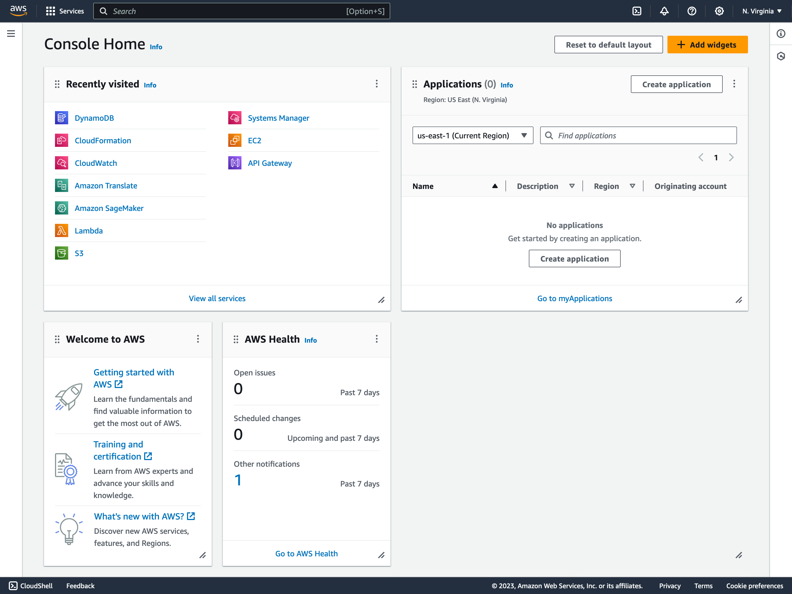
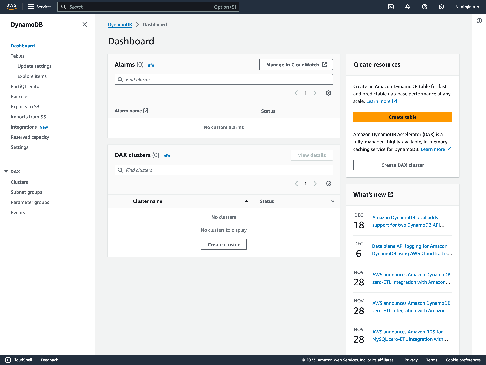
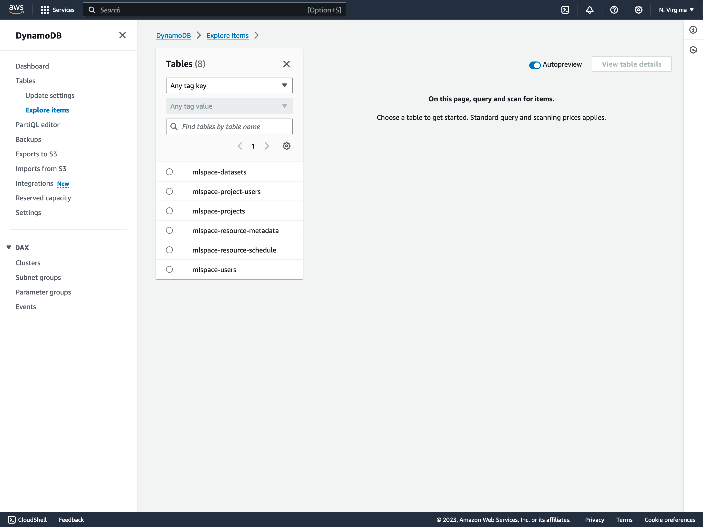
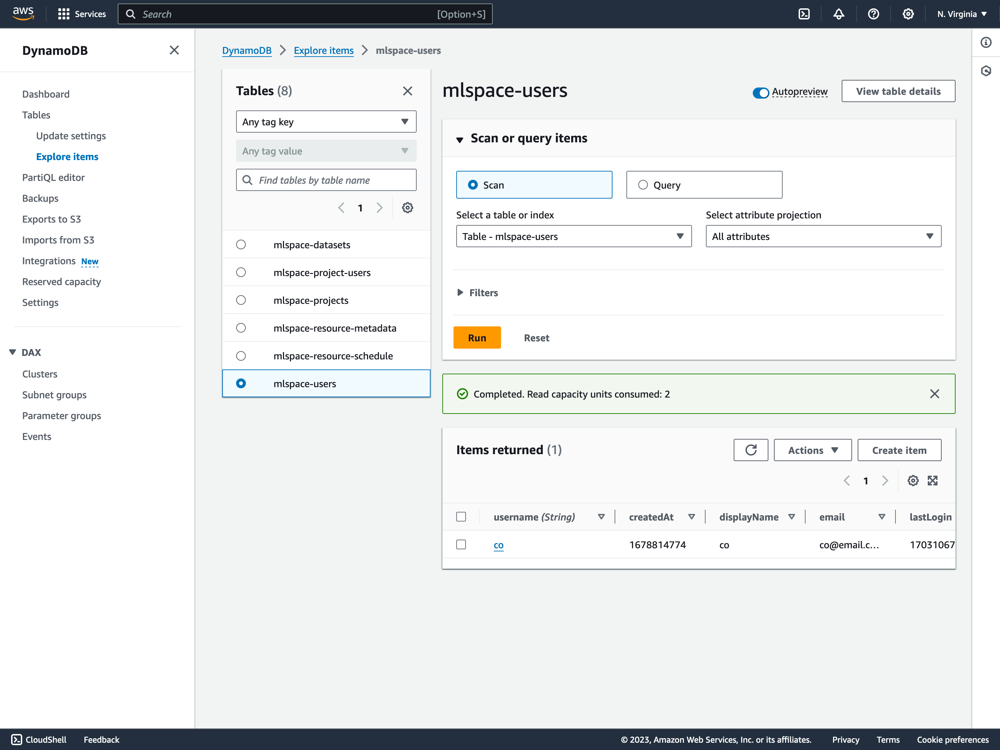
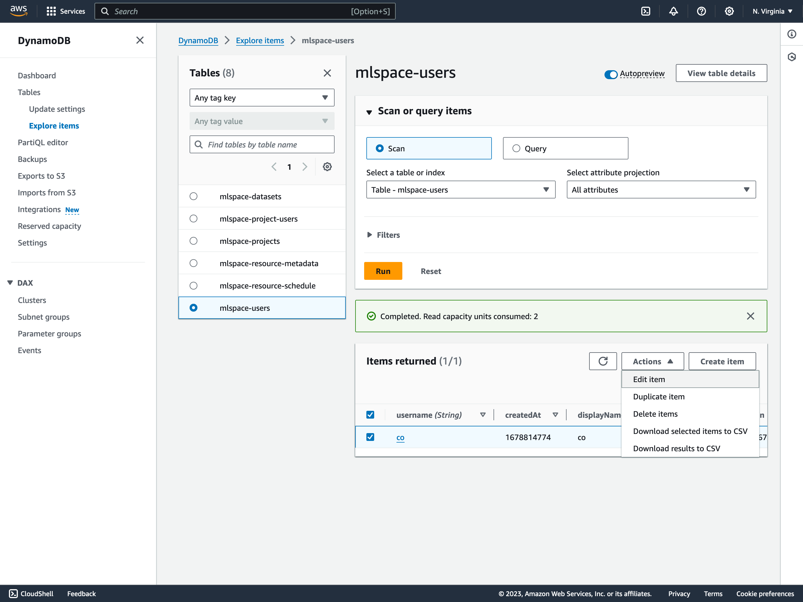
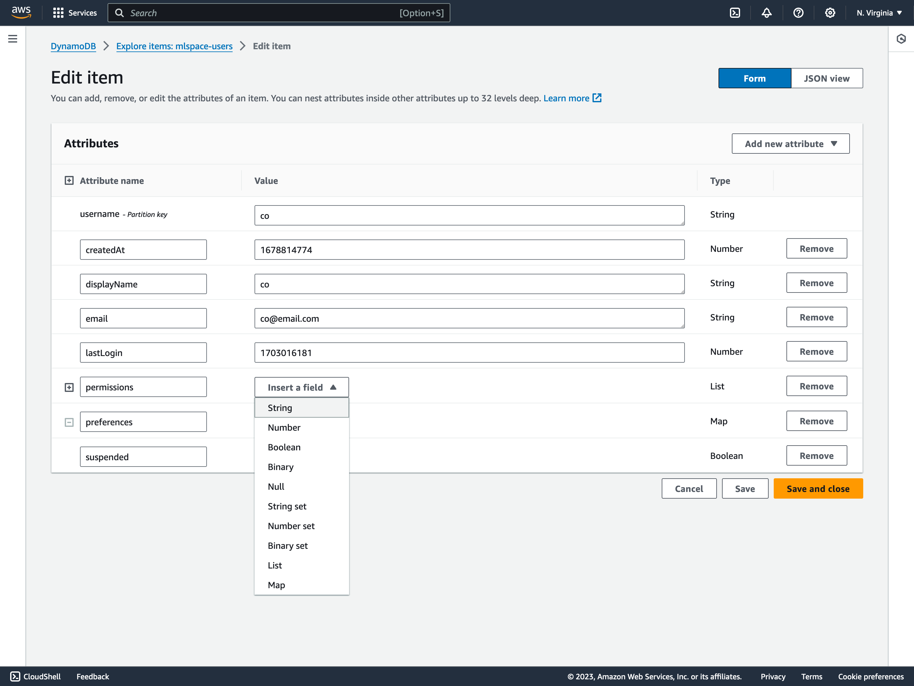
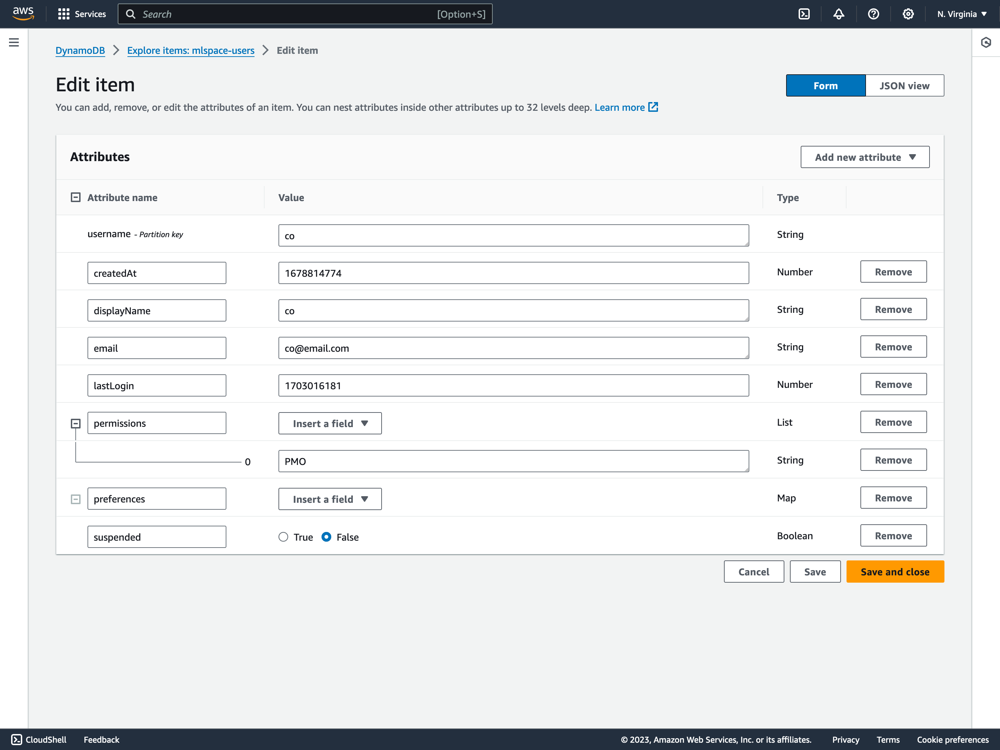
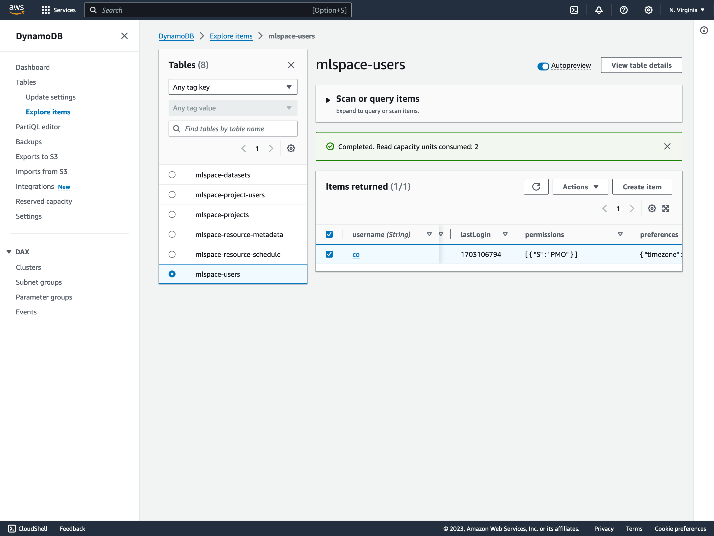

# Grant Admin Permissions to Initial Admin
By default users are created without any elevated privileges and, depending on the value set for `NEW_USERS_SUSPENDED`, will be created in a suspended state unable to interact with the application. In order to grant the inital Admin elevated privileges you'll need to modify the user record in Dynamo DB. Subsequent users can have permissions/suspension state managed directly in the {{ $params.APPLICATION_NAME }} UI by any user with the `PMO` permission.
## Using the AWS CLI

You can use the aws CLI to make the necessary update, be sure to set the correct region and username. If you’ve updated the table name from the default you’ll also need to ensure that is correct.
```
aws dynamodb --region us-east-1 update-item \
    --table-name mlspace-users \
    --key '{ "username": {"S": "<username here>"}}' \
    --update-expression "SET #p = :newval, suspended=:boolval" \
    --expression-attribute-names '{"#p":"permissions"}' \
    --expression-attribute-values '{":newval":{"L":[{"S":"PMO"}]}, ":boolval":{"BOOL":false}}' \
    --return-values ALL_NEW
```


## Using the AWS console

Login to the AWS account you’ve deployed {{ $params.APPLICATION_NAME }} to as a user with write permissions to DynamoDB (Admin works)

Navigate to the DynamoDB console

Select “Explore Items” on the lefthand side under “Tables”

Select the “mlspace-users” table from the “Tables” list (if you renamed this table as part of setup select the correct users table)

Next select the checkmark next to the user you wish to make an admin and click “Actions” -> “Edit Item”

Next to the “permissions” attribute select “Insert a field” to open the field type dropdown and select “String”

In the resulting text box enter “PMO” and click “Save changes” in the bottom right

Verify the item has been correctly updated in the items view


__If neccessary you can use the same process to update a users suspended status__